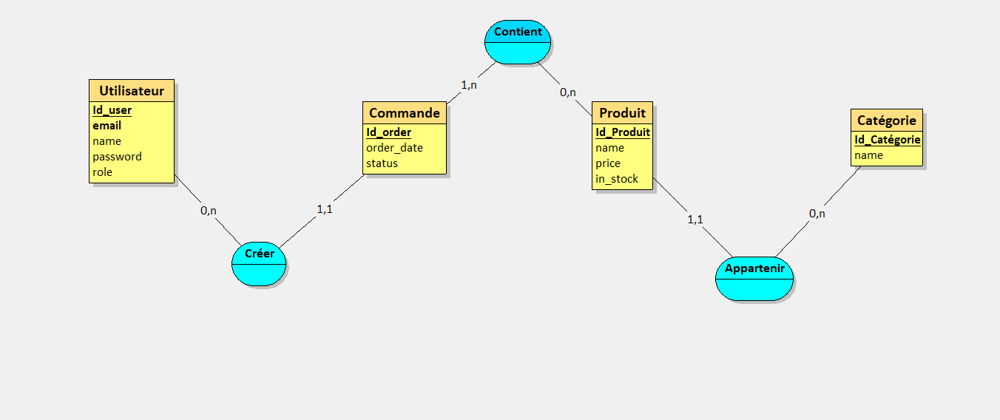
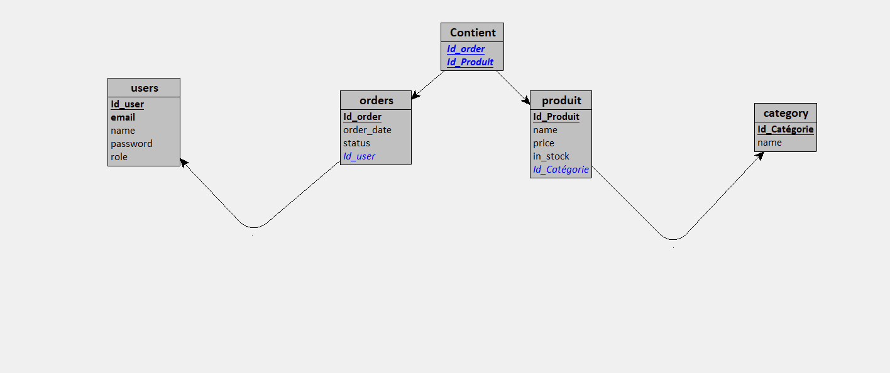
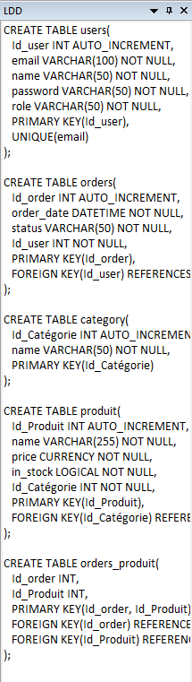
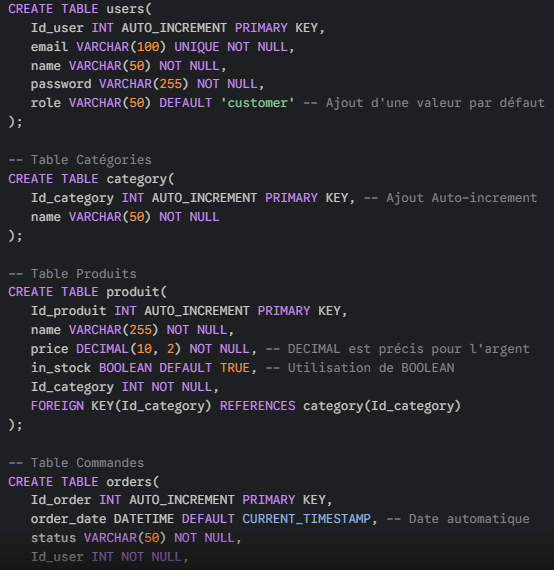

# MISSION 1 : Création de la base de données / Looping

# MISSION 2 : Création des TABLES

# MISSION 3 : Insertion de catégories

INSERT INTO category (name) VALUES
('RPG'),
('Aventure'),
('FPS'),
('Sport');

# MISSION 4 : Insertion de produits

INSERT INTO produit (name, price, in_stock, Id_Categorie) VALUES
('The Witcher 3', 39.99, TRUE, 1),
('Assassin\'s Creed Valhalla', 49.99, TRUE, 2),
('Call of Duty : Modern Warfare', 59.99, TRUE, 3),
('FIFA 22', 29.99, TRUE, 4),
('Elden Ring', 59.99, TRUE, 1),
('Uncharted 4', 19.99, TRUE, 2),
('Battlefield 2042', 14.99, FALSE, 3),
('NBA 2K23', 29.99, TRUE, 4);

# MISSION 5 : Insertion d'utilisateurs

INSERT INTO users (email, name, password, role) VALUES
('admin@pixelbay.com', 'Admin_Boss', 'hash_secure_123', 'admin'),
('lucas.gamer@gmail.com', 'Lucas', 'pass_lucas_99', 'client'),
('emma.v@outlook.fr', 'Emma', 'emma_pixel_2024', 'client'),
('jean.test@yahoo.fr', 'Jean_Test', 'test_password_456', 'client'),
('sophie.pro@gmail.com', 'Sophie', 'sophie_secret_789', 'client');

# MISSION 6 :  Insertion de commandes

INSERT INTO orders (status, Id_user) VALUES
('En attente', 2),
('expédiée', 3),
('livrée', 4),
('annulée', 5),
('livrée', 2);

# MISSION 7 : Insertion des liens commandes-produits

INSERT INTO Contient (Id_order, Id_Produit) VALUES
(2, 3),
(2, 2), (2, 6), 
(3, 3), (3, 7), (3, 1), (3, 5), 
(4, 4), 
(5, 8), (5, 4);

SELECT * FROM contient;

# MISSION 8 : Requêtes de sélection

Écrire une requête pour mettre à jour le prix d'un produit existant : 
SELECT p.name, p.price, c.name FROM produit p JOIN category c 
ON p.Id_categorie = c.Id_categorie 
WHERE c.name = 'RPG' AND p.in_stock = TRUE;

Écrire une requête pour trouver tous les produits en stock triés par prix croissant :
SELECT * FROM produit p WHERE p.in_stock = TRUE ORDER BY p.price ASC;

Écrire une requête pour afficher le nombre de produits par catégorie :

SELECT c.name AS Categorie, COUNT(p.name) AS Nombre_de_Produits
FROM produit p
JOIN category c ON p.Id_Categorie = c.Id_Categorie
GROUP BY c.name;

# MISSION 9 : Mises à jour des données

Écrire une requête pour mettre à jour le prix d'un produit existant
UPDATE produit
SET price = 29.99
WHERE name = 'The Witcher 3';

Écrire une requête pour changer le statut d'une commande à "livrée"
UPDATE orders
SET status = 'livrée'
WHERE Id_user = 3;

Écrire une requête pour mettre un jeu en rupture de stock (in_stock = FALSE)
UPDATE produit
SET in_stock = FALSE
WHERE name = 'Elden Ring';

# MISSION 10 : Fonctions avancées (GROUP BY, AVG, MAX, MIN) :

Écrire une requête pour calculer le prix moyen des produits par catégorie :

Id_Categorie    Nom
1               RPG
2               Aventure
3               FPS
4               Sport

Produit

1 The Witcher 3
2 Assassin's Creed Valhalla
3 Call of Duty : Modern Warfare
4 FIFA 22
5 Elden Ring
6 Uncharted 4
7 Battlefield 2042
8 NBA 2K23

USERS : 

Id_user                      Nom                                     Email                             Rôle
1                           Admin_Boss                            admin@pixelbay.com                  admin
2                           Lucas                                 lucas.gamer@gmail.com               client
3                           Emma                                  emma.v@outlook.fr                   client
4                           Jean_Test                             jean.test@yahoo.fr                  client
5                           Sophie                                sophie.pro@gmail.com                client

Order : 

Id_order                  Status                                     Id_user                         Propriétaire
1                        En attente                                    2                                Lucas
2                        expédiée                                      3                                Emma
3                        livrée                                        4                                Jean
4                        annulée                                       5                               Sophie
5                        livrée                                        2                                Lucas